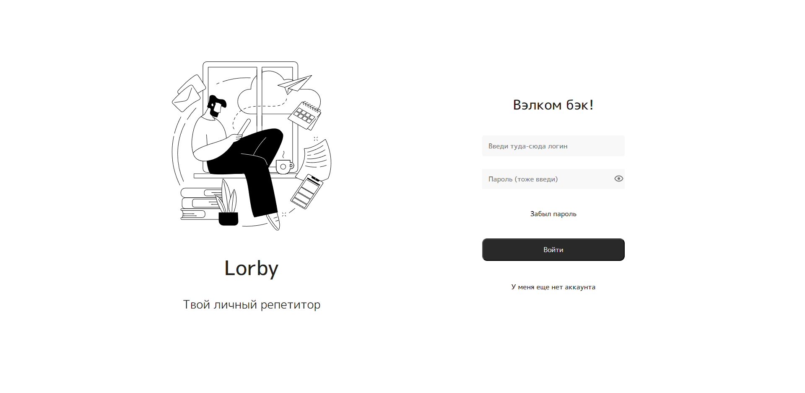
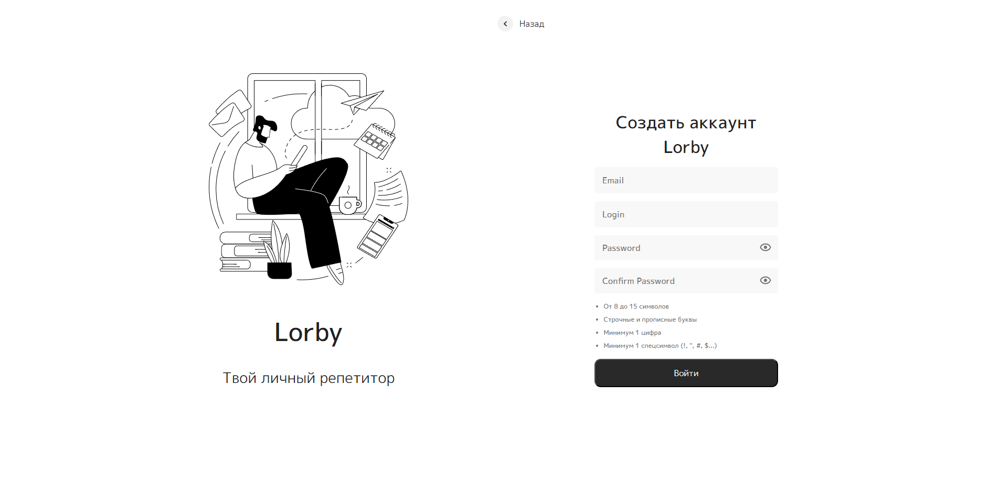
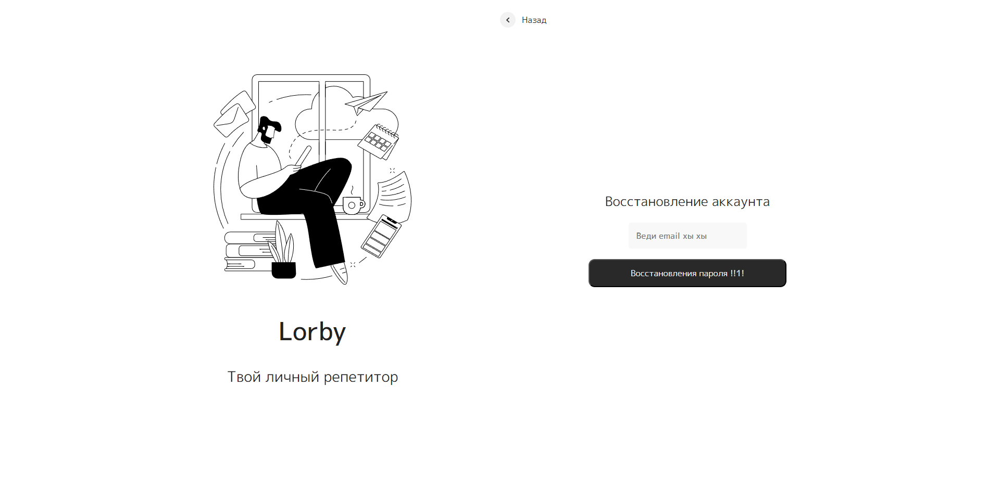

# Lorby Authentication

Testing SPA job to implement authorisation and registration with API + JWT token

Adding Validation to Formik + Yup







## Deployment


## Technologies

The following technologies are used in the project:

- React
- Redux-Toolkit
- TypeScript
- React-toastify
- Formik + Yup

## Installation

1. **Install Node.js**.

   You can download it from the official Node.js website.

2. **Clone the project**.

   Use git to clone the project on your machine.

3. **Installing dependencies**.

   Go to the project directory and install the required dependencies using npm:

   ```
   npm install
   ```

4. **Start the project**

   Once all dependencies are installed, you can start the project using the command:

   ```
   npm run dev
   ```

## Author

Erlan Abdraimov

## Licence

This project is licensed under the MIT licence.

Translated with DeepL.com (free version)
